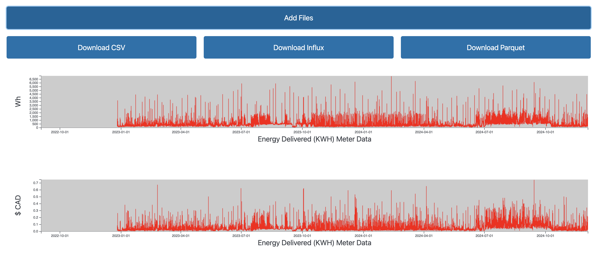
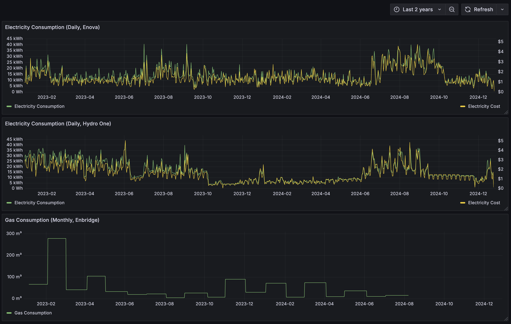

# Green Button Engine

This is a reusable library for convering [Green Button Engine](https://www.greenbuttondata.org/) XML
into more usable formats (csv, influxdb, parquet).

Try it online [here](https://tdresser.github.io/green-button-engine/).



It's implemented as a rust library (see [lib/personalgreenbutton](lib/personalgreenbutton)).
There's a commandline tool in [cli-frontend](cli-frontend).

InfluxDB export lets you get this into grafana, to build custom graphs like this:


## CLI Frontend

Install rust with [rustup](https://rustup.rs/).

```sh
cd cli-frontend
cargo run -- --help
cargo run ../test_files/* --filetype=csv
```

## Vision

Long term, I hope to add auth support to this project, for fetching Green Button data from providers. Building a good frontend for this data is something I'd love to do at some point, but it will almost certainly live outside this repo, to keep this repo available as a generic library for getting Green Button data into convenient formats.

## Contributing

The easiest way to contribute today is to send a PR adding a test file. Even better if it currently fails to parse! Several of the providers I've tested don't adhere to the spec, and I'd like the parser to handle these cases as much as possible.

When we do identify providers failing to adhere to the spec, we should also provide feedback to those providers! I've reached out to a number of providers so far, and they've generally been happy to improve their output.

Beyond that, take a look at the open issues in this repo, or improve the (mostly nonexistant) test coverage!

## Development

### Dependencies

Install rust, [rustup](https://rustup.rs/) is recommended.

#### Web Frontend Dependencies

```sh
cargo install wasm-pack
```

Install node, [nvm](https://github.com/nvm-sh/nvm?tab=readme-ov-file#installing-and-updating) is recommended.

### Web Frontend

#### Running

```sh
cd lib/wasm
wasm-pack build --target web --release
cd ../../web-frontend
npm install
npm run dev
```

The web frontend pulls the wasm blob directly from it's output location.

#### Bindgen approach

In general, we make objects cloneable, but skip binding every field. Then we provide non-copying getters where possible.

#### Binary size

Keeping the binary size low for the wasm version is important to keep the load time reasonable. There's some low hanging fruit here still.

Measure size via:

```sh
gzip -9 < lib/wasm/pkg/wasm_bg.wasm | wc -c
```

## The Green Button file format.

The XML schema for the format can be found [here](https://naesb.org/espi.xsd), with a more human readable format [here](https://dev.greenbuttonalliance.org/espiusecase.html).

## Architecture

We current parse `Entry`s, `IntervalReading`s and `ReadingType`s. There are other entries we should parse eventually, but this gives us the primary values and costs.

Each of these is stored as a "Columnar Struct Vec," via a procedural macro defined in [lib/columnar_struct_vec](./lib/columnar_struct_vec/). This makes it easy to build a struct of vecs where each vec represents one field. We use a columnar representation (struct of vecs) instead of a row based representation (vec of structs) both because it leads to better performance for some operations, such as passing data across the WASM/javascript boundary, and because it makes it easier to convert this data into Apache Arrow format.

The core logic for flattening these structs into a single timeseries lives in [lib/personalgreenbutton/src/lib.rs](./lib/personalgreenbutton/src/lib.rs).

The Green Button format relies heavily on enums, where the mapping from enum number to string is defined in [espi.xsd.xml](./lib/personalgreenbutton/preprocessing/espi.xsd.xml). We parse this and store the mappings we care about at build time, in [build.rs](./lib/personalgreenbutton/build.rs).
